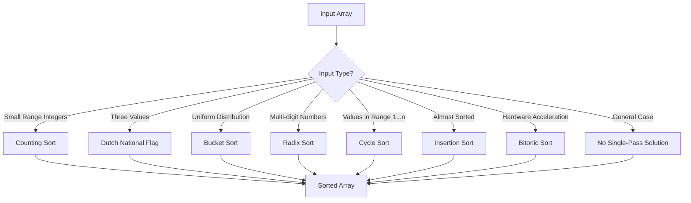

# Sorting Algorithm Decision Framework

This document provides guidance on selecting the appropriate single-pass, in-place sorting algorithm based on input characteristics.

## Decision Flowchart

## Algorithm Selection Guide

### Counting Sort
- **When to use**: Small range of integer values
- **Example**: Sorting ages of people (0-120)
- **Advantages**: O(n+k) time, O(k) space
- **Constraints**: Works only for non-negative integers in a known range [0,k]

### Dutch National Flag
- **When to use**: Arrays containing exactly three distinct values
- **Example**: Sorting an array of 0s, 1s, and 2s
- **Advantages**: O(n) time, O(1) space
- **Constraints**: Only works with three distinct values

### Cycle Sort
- **When to use**: Arrays with values in range [1...n]
- **Example**: Rearranging arrays where each element should be at its indexed position
- **Advantages**: Minimal memory writes, O(1) space
- **Constraints**: O(n²) time worst case

### Radix Sort
- **When to use**: Multi-digit numbers with known digit count
- **Example**: Sorting large integers or strings of the same length
- **Advantages**: O(d*(n+k)) time, where d is the number of digits
- **Constraints**: Each digit pass is single-pass, but overall needs multiple passes

### Bucket Sort
- **When to use**: Uniformly distributed values
- **Example**: Floating point numbers in a small range
- **Advantages**: Average O(n) time
- **Constraints**: Performance depends on distribution, O(n) space

### Bitonic Sort
- **When to use**: Hardware-accelerated environments (parallel processing)
- **Example**: GPU-based sorting
- **Advantages**: O(log²n) parallel steps, highly parallelizable
- **Constraints**: Array length must be a power of 2

## Performance Comparison

| Algorithm | Time Complexity | Space Complexity | In-Place | Stable | Single-Pass |
|-----------|-----------------|------------------|----------|--------|-------------|
| Counting Sort | O(n+k) | O(k) | No | Yes | Yes |
| Dutch National Flag | O(n) | O(1) | Yes | No | Yes |
| Cycle Sort | O(n²) | O(1) | Yes | No | Yes |
| Radix Sort | O(d*(n+k)) | O(n+k) | No | Yes | No (d passes) |
| Bucket Sort | O(n) average | O(n) | No | Depends | Yes |
| Bitonic Sort | O(log²n) parallel | O(1) | Yes | No | No |

## Implementation Considerations

1. **Memory access patterns**: Optimize for cache locality
2. **Hardware constraints**: Some algorithms are better suited for specific hardware
3. **Input distribution**: Performance varies based on data characteristics
4. **Memory constraints**: Choose algorithms based on available memory

## References

- Cormen, T. H., Leiserson, C. E., Rivest, R. L., & Stein, C. (2009). Introduction to Algorithms (3rd ed.). MIT Press.
- Knuth, D. E. (1998). The Art of Computer Programming, Volume 3: Sorting and Searching (2nd ed.). Addison-Wesley.
